

  
  <h3 align="center">Matrix patterns</h3>

## Instructions
Uncomment a formula from `calculateFormula` function and run `go run main.go`;

## Formulas
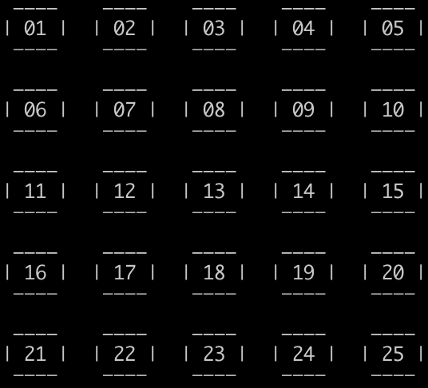 
maxColumns * (currentRow-1) + currentColumn

---
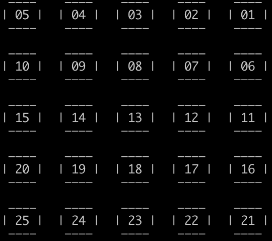 
maxColumns * (currentRow - 1) + maxColumns - currentColumn + 1

---
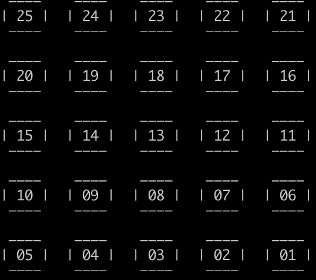 
maxColumns * (maxRows - currentRow) + maxColumns - currentColumn + 1

---
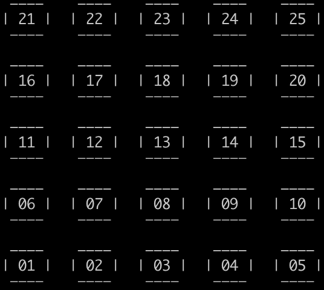 
maxColumns * (maxRows - currentRow) + currentColumn

---
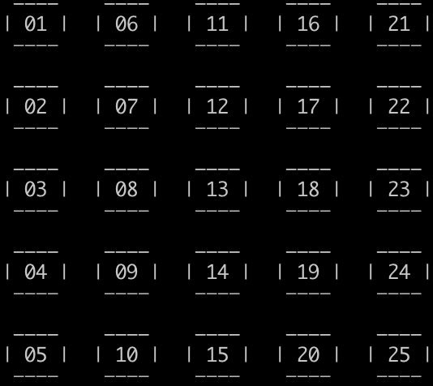 
maxRows * (currentColumn - 1) + currentRow

---
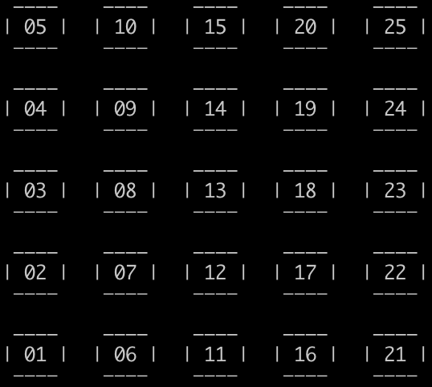 
maxRows * (currentColumn - 1) + maxRows - currentRow + 1

---
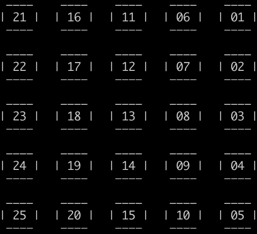 
maxRows * (maxColumns - currentColumn) + currentRow

---
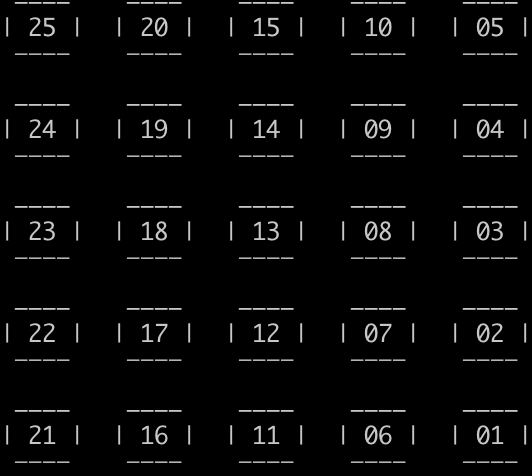 
maxRows * (maxColumns - currentColumn) + maxRows - currentRow + 1

---
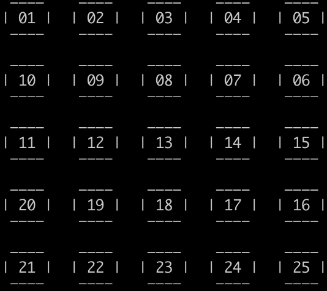 
(int(math.Max(0, math.Pow(-1, float64(currentRow+1)))))*(maxColumns*(currentRow-1)+currentColumn) + ((int(math.Max(0, math.Pow(-1, float64(currentRow))))) * (maxColumns*(currentRow-1) + maxColumns - currentColumn + 1))

---
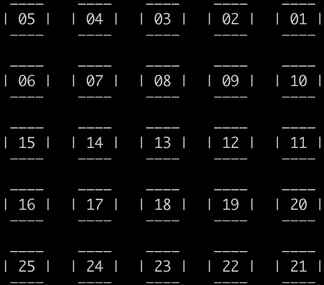 
((int(math.Max(0, math.Pow(-1, float64(currentRow+1))))) * (maxColumns*(currentRow-1) + maxColumns - currentColumn + 1)) + (int(math.Max(0, math.Pow(-1, float64(currentRow)))) * (maxColumns*(currentRow-1) + currentColumn))

---
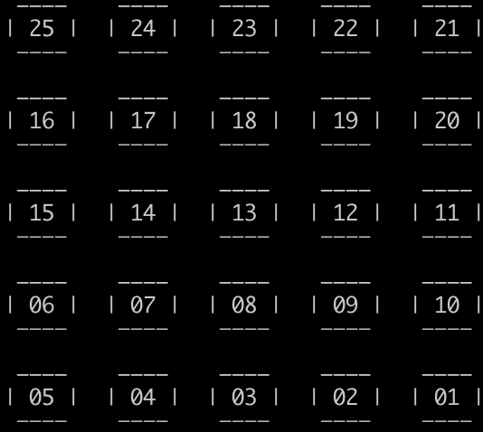 
((int(math.Max(0, math.Pow(-1, float64(currentRow+1))))) * (maxColumns*(maxRows-currentRow) + maxColumns - currentColumn + 1)) + (int(math.Max(0, math.Pow(-1, float64(currentRow)))) * (maxColumns*(maxRows-currentRow) + currentColumn))

---
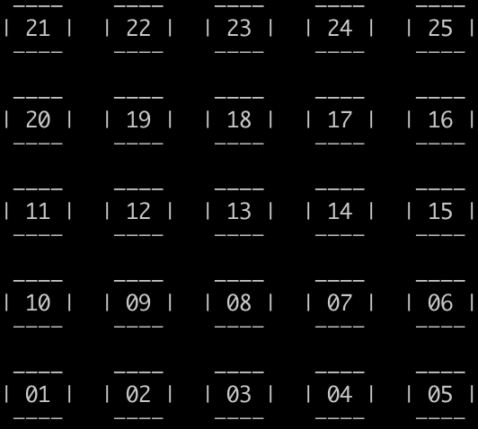 
((int(math.Max(0, math.Pow(-1, float64(currentRow+1))))) * (maxColumns*(maxRows-currentRow) + currentColumn)) + (int(math.Max(0, math.Pow(-1, float64(currentRow)))) * (maxColumns*(maxRows-currentRow) + maxColumns - currentColumn + 1))

---
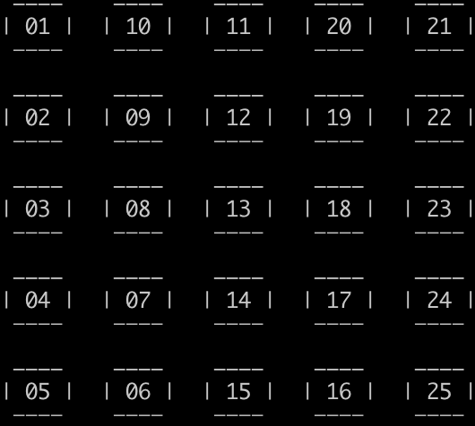 
((int(math.Max(0, math.Pow(-1, float64(currentColumn+1))))) * (maxRows*(currentColumn-1) + currentRow)) + (int(math.Max(0, math.Pow(-1, float64(currentColumn)))) * (maxRows*(currentColumn-1) + maxRows - currentRow + 1))

---
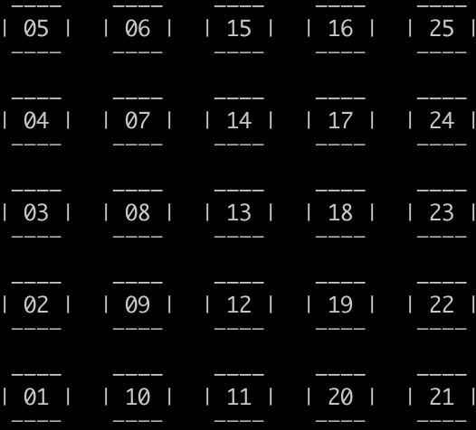 
((int(math.Max(0, math.Pow(-1, float64(currentColumn+1))))) * (maxRows*(currentColumn-1) + maxRows - currentRow + 1)) + (int(math.Max(0, math.Pow(-1, float64(currentColumn)))) * (maxRows*(currentColumn-1) + currentRow))

---
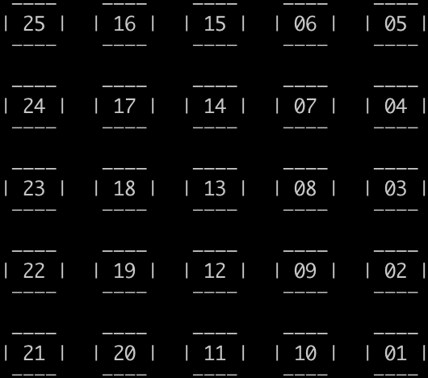 
((int(math.Max(0, math.Pow(-1, float64(currentColumn+1))))) * (maxRows*(maxColumns-currentColumn) + maxRows - currentRow + 1)) + (int(math.Max(0, math.Pow(-1, float64(currentColumn)))) * (maxRows*(maxColumns-currentColumn) + currentRow))

---
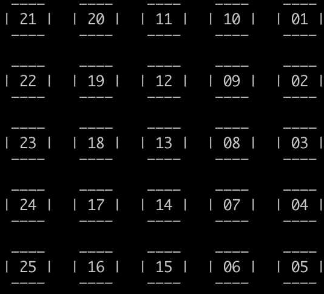 
((int(math.Max(0, math.Pow(-1, float64(currentColumn+1))))) * (maxRows*(maxColumns-currentColumn) + currentRow)) + (int(math.Max(0, math.Pow(-1, float64(currentColumn)))) * (maxRows*(maxColumns-currentColumn) + maxRows - currentRow + 1))
